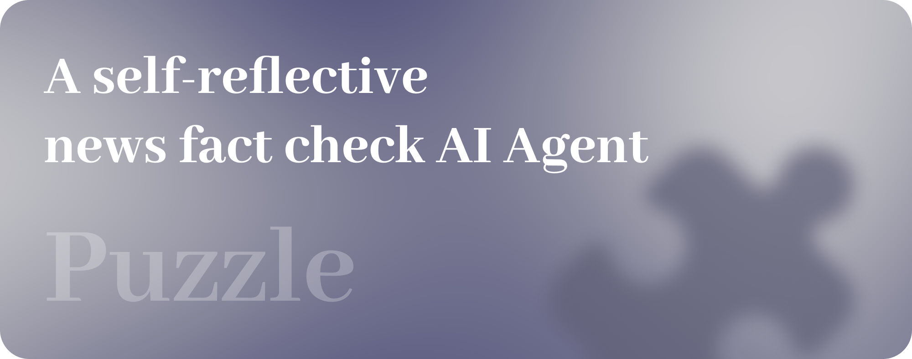

# Puzzle
Puzzle是一个自我反思的新闻事实核查AI代理，基于深度搜索的理念。通过利用深网搜索和跨多个证据的推理，Puzzle细致地追踪和验证新闻来源，使您能够自信地区分事实与虚构。

## 特性
- 🔍 深度搜索：Puzzle在新闻和证据之间遵循逻辑痕迹，深入挖掘，直到找到真相。
- 🧠 自我反思推理：Puzzle在采取下一步行动之前会进行全面思考。它可以根据搜索结果动态调整策略，以符合目标。
- 📊 多代理协作：Puzzle利用多个专业代理协同工作，一个代理专注于推理，其他代理则执行行动，以实现最佳结果。
- 📝 可靠的新闻事实核查方法：Puzzle始终关注可验证和可信赖的来源，并忠于第一手材料。

## 工作原理
这是 Puzzle 的原理示意图

## 快速开始
TODO